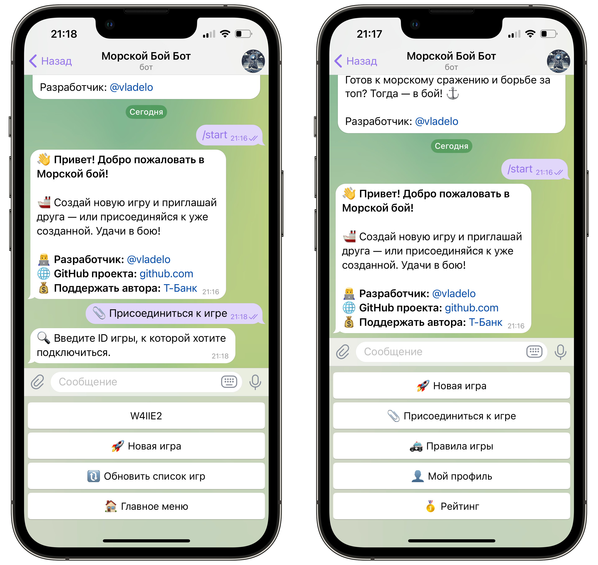
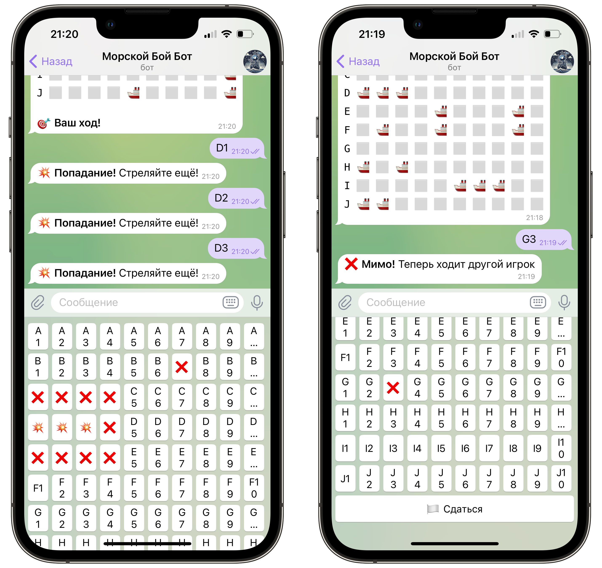
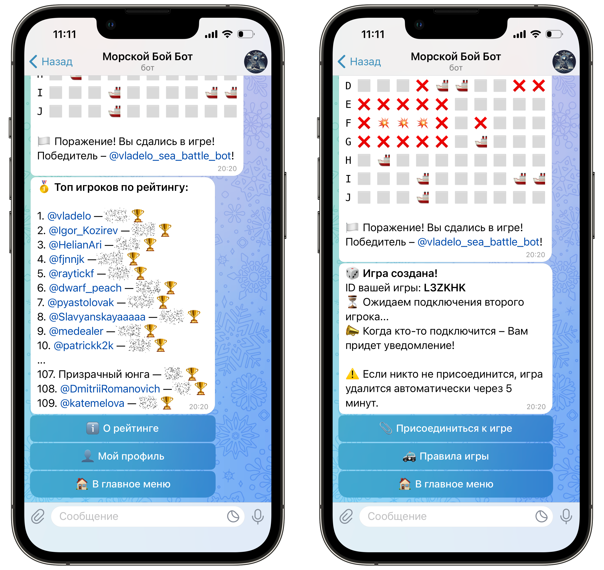

### 🚀 **[👉 Перейти к боту в Telegram](https://t.me/vladelo_sea_battle_bot)**

[](https://docs.aiogram.dev/)
[](https://www.python.org/)
[](https://docs.python.org/3/library/asyncio.html)
[](https://www.sqlalchemy.org/)
[](https://www.sqlite.org/index.html)
[](https://alembic.sqlalchemy.org/)
[](https://pypi.org/project/python-dotenv/)
[](https://docs.python.org/3/library/random.html)
[](https://docs.python.org/3/library/os.html)
[](https://docs.python.org/3/library/logging.html)
[](https://www.docker.com/)

# **Sea-Battle-Bot** 🌊

**Sea-Battle-Bot** — это увлекательный Telegram-бот для игры в классический **морской бой** между двумя игроками! 💥  
Погрузитесь в атмосферу морского сражения и испытайте свои тактические навыки на поле боя! ⚔️

🚀 **[Перейти к боту в Telegram](https://t.me/vladelo_sea_battle_bot)**

---

## 🎮 **Основные возможности**

- 🆕 **Создание новой игры** и подключение к существующей.
- 👥 **Дуэли между двумя игроками** в реальном времени.
- 🔥 **Полноценная механика боя** с интуитивным вводом координат.
- 🎯 **Интерактивные кнопки** для выстрелов по полю.
- 📡 **Уведомления о ходе игры** и результатах выстрелов.
- 🗺️ **Отображение** своего и вражеского поля.
- 📝 **Подробные сообщения** о ходе и результатах игры.
- 🏳️ **Возможность сдаться** в любой момент.
- 📋 **Личная статистика** – матчи, победы, поражения, рейтинг.
- 📊 **Рейтинг игроков** на основе системы Elo.

---

## 🚀 **Как начать игру**

🚀 **[Перейти к боту в Telegram](https://t.me/vladelo_sea_battle_bot)**

1. 🔗 Или найдите бота в Telegram и запустите его.
   ```
   @vladelo_sea_battle_bot
   ```
2. 📝 Создайте новую игру по кнопке:
   ```
   🚀 Новая игра
   ```
3. ⏱️ Дождитесь подключения второго игрока.
4. 🛜 Или подключитесь сами по кнопке:
   ```
   📎 Присоединиться к игре
   ```
5. 🗳️ Выберите доступные игры в меню.
6. 🪖 Получите сообщение о начале игры с именем игрока, который ходит первым.
7. 🎯 Стреляйте, выбирая координаты на интерактивной клавиатуре! Например:
   ```
   А1
   ```
8. 💥 Наслаждайтесь яркими эффектами попаданий и промахов!
9. 🏆 Победите, уничтожив все корабли противника!
10. 👤 Просматриваете свою статистику: матчи, победы, поражения, рейтинг.
11. 🥇 Отслеживайте общий рейтинг и занимайте первые места!







---

### 🎯 Технологии

Бот реализован с использованием следующих технологий и библиотек:

- **[Aiogram](https://docs.aiogram.dev/)** — асинхронный фреймворк для создания Telegram-ботов на Python.  
  Позволяет удобно обрабатывать команды, текстовые сообщения, инлайн- и reply-кнопки, а также работать с контекстом
  пользователей. Поддерживает фильтры, FSM и middlewares.


- **[SQLAlchemy](https://www.sqlalchemy.org/)** — мощная ORM-библиотека для работы с базой данных.  
  Применяется для хранения информации об игроках, матчах и статистике. Используется как с декларативными моделями, так и
  с ручными запросами.


- **[Alembic](https://alembic.sqlalchemy.org/)** — инструмент управления миграциями базы данных.  
  Позволяет отслеживать изменения в моделях и автоматически генерировать SQL-команды для обновления структуры БД без
  потери данных.


- **[SQLite](https://www.sqlite.org/index.html)** — встроенная реляционная база данных.  
  Проста в использовании, не требует отдельного сервера и отлично подходит для небольших проектов. Все данные хранятся в
  одном `.sqlite3` файле.


- **[Asyncio](https://docs.python.org/3/library/asyncio.html)** — стандартная библиотека Python для асинхронного
  программирования.  
  Обеспечивает высокую производительность, параллельную обработку сообщений и работу с задержками (например, таймеры и
  автоудаление игр).


- **[Python-dotenv](https://pypi.org/project/python-dotenv/)** — утилита для загрузки переменных окружения из `.env`
  файла.  
  Упрощает конфигурацию: токены, секреты и параметры подключения удобно хранить вне кода.


- **[Logging](https://docs.python.org/3/library/logging.html)** — встроенный модуль логирования Python.  
  Используется для ведения журнала событий: действий игроков, ошибок и операций с базой.


- **[Docker](https://www.docker.com/)** — контейнеризация приложения.  
  Позволяет легко развернуть бота на любом сервере без ручной настройки окружения.


- **[Pydantic](https://docs.pydantic.dev/)** — для валидации конфигурации и моделей данных (может использоваться в
  `config.py`).

---

Эта связка технологий обеспечивает стабильную, масштабируемую и легко расширяемую архитектуру бота.

## 📂 **Структура проекта**

```
Sea-Battle-Bot/
├── Dockerfile                     # Docker-конфигурация для сборки контейнера
├── README.md                      # Документация проекта
├── alembic.ini                    # Настройки Alembic для миграций
├── requirements.txt               # Зависимости проекта
│── .env                           # Файл с токеном бота (НЕ добавляется в Git)
│── .env.template                  # Шаблон .env файла
│── .gitignore                     # Исключаем .env, __pycache__, venv и прочее
│── .dockerignore                  # Исключаем ненужное из Docker-образа
│
├── photos/                        # Папка с изображениями для README
│   ├── Example-photo1.png
│   └── Example-photo2.png
│
├── alembic/                       # Миграции базы данных (Alembic)
│   ├── env.py                     # Главный файл окружения Alembic
│   ├── script.py.mako             # Шаблон скрипта миграции
│   └── versions/                  # Каталог с версиями миграций
│       └── c29db636bb_init_db.py  # Первая миграция
│
├── app/                           # Основная логика Telegram-бота
│   ├── __init__.py
│   ├── bot.py                     # Точка входа в бота (запуск)
│   ├── config.py                  # Конфигурация окружения (переменные, пути)
│   ├── database.py                # Подключение к базе данных через SQLAlchemy
│   ├── dependencies.py            # Вспомогательные зависимости (сессия БД)
│   ├── game_logic.py              # Основная игровая логика (проверка выстрелов, победы)
│   ├── keyboards.py               # Клавиатуры для Telegram
│   ├── logger.py                  # Настройка логгера
│   ├── storage.py                 # Логика in-memory-хранилища
│   │
│   ├── db_utils/                  # Работа с БД (CRUD-операции)
│   │   ├── match.py               # Логика создания и обновления матчей
│   │   ├── player.py              # Работа с игроками
│   │   └── stats.py               # Обновление статистики
│   │
│   ├── handlers/                  # Обработчики Telegram-сообщений
│   │   ├── base.py                # /start, главное меню и другие базовые команды
│   │   ├── game.py                # Игровой процесс (выстрелы, победа, сдача)
│   │   ├── matchmaking.py         # Создание и подключение к играм
│   │   ├── register.py            # Регистрация хендлеров
│   │   └── stats.py               # Показ статистики, рейтингов
│   │
│   ├── messages/                  # Текстовые сообщения
│   │   └── texts.py
│   │
│   ├── models/                    # SQLAlchemy модели
│   │   ├── base.py                # Базовая модель
│   │   ├── match.py               # Модель матча
│   │   ├── player.py              # Модель игрока
│   │   └── player_stats.py        # Модель статистики игрока
│   │
│   ├── services/                  # Бизнес-логика
│   │   ├── game_service.py        # Работа с in-memory играми
│   │   ├── matchmaking_service.py # Создание / подключение игр
│   │   └── player_service.py      # Регистрация / обновление игроков
│   │
│   ├── state/                     # Состояния и глобальные переменные
│   │   ├── constants.py           # Константы проекта
│   │   └── in_memory.py           # Словари in-memory (игры, очередь, таймеры)
│   │
│   └── utils/                     # Утилиты, не относящиеся напрямую к логике
│       ├── game_cleanup.py        # Автоудаление неактивных игр
│       ├── game_id.py             # Генерация ID игры
│       ├── none_username.py       # Подмена username у пользователей без него
│       └── rating.py              # Реализация рейтинга Elo


```

---

### ✅ Преимущества архитектуры проекта

- **Чёткое разделение ответственности**  
  Логика бота разбита по слоям: обработчики (`handlers`), бизнес-логика (`services`), работа с БД (`db_utils`),
  утилиты (`utils`), тексты (`messages`) — это упрощает навигацию и поддержку кода.


- **Принцип единой ответственности (SRP)**  
  Каждый модуль выполняет строго одну задачу — например, `matchmaking_service.py` занимается только матчмейкингом, а
  `player_service.py` — только регистрацией игроков.


- **Масштабируемость**  
  Проект легко расширяется: можно добавлять новые команды, функции, модели без риска "сломать" существующий функционал.


- **Переиспользуемость кода**  
  Повторяющаяся логика вынесена в сервисы и утилиты. Это повышает читаемость и снижает дублирование кода.


- **Гибкая работа с БД**  
  Используется SQLAlchemy + Alembic для управления схемой БД, что упрощает миграции и поддержку данных.


- **Инфраструктура готова к деплою**  
  В проекте предусмотрены `Dockerfile`, `.env`, `.dockerignore`, что позволяет быстро развернуть бота на сервере или в
  контейнере.


- **Удобство для команды разработки**  
  Новым разработчикам будет просто разобраться в проекте — структура интуитивно понятна и документирована комментариями.


- **Интеграция in-memory и persistent-хранилища**  
  Используется in-memory-хранилище (`state/in_memory.py`) для быстрого доступа, а также SQL-база для долгосрочного
  хранения данных (статистика, рейтинги).


- **Модульность**  
  Благодаря модульной структуре можно писать unit-тесты на отдельные компоненты без запуска всего бота.

---

## 🛠️ **Технические детали**

- 🐍 Язык программирования: **Python**
- 🤖 Фреймворк: **Aiogram**
- 🗃️ Хранение данных: **SQLite** с использованием **SQLAlchemy** и миграций через **Alembic**
- 🔄 Асинхронность: реализована через **asyncio** для высокой производительности
- 💡 Логика игры: поля представлены в виде двумерного списка с символами:
    - ⬜ — пустая клетка
    - 🚢 — часть корабля
    - ❌ — промах
    - 💥 — попадание
- 📊 Рейтинг: рассчитывается по системе **Elo** после каждой завершённой игры

---

## 📝 **Установка и запуск**

### 🔧 Вариант 1: Локальный запуск

1. 🗃️ Клонируйте репозиторий:
   ```bash
   git clone https://github.com/vladelo-code/Sea-Battle-Bot.git
   ```
2. 📂 Перейдите в папку проекта:
   ```bash
   cd Sea-Battle-Bot
   ```
3. 📦 Установите зависимости:
   ```bash
   pip install -r requirements.txt
   ```
4. ⚙️ Создайте `.env` на основе `.env.template` и укажите ваш токен:
   ```bash
   cp .env.template .env
   ```
5. 🛠️ Примените миграции базы данных:
    ```bash
   alembic upgrade head
   ```
6. 🚀 Запустите бота:
   ```bash
   python app/bot.py
   ```

### 🐳 Вариант 2: Запуск через Docker

1. Клонируйте репозиторий:
   ```bash
   git clone https://github.com/vladelo-code/Sea-Battle-Bot.git
   ```
2. Перейдите в папку проекта:
   ```bash
   cd Sea-Battle-Bot
   ```
3. Создайте `.env` на основе `.env.template` и укажите ваш токен:
   ```bash
   cp .env.template .env
   ```
4. Постройте и запустите контейнер:
   ```bash
   docker run -it --env-file .env sea-battle-bot
   ```

---

## 💡 **Подробнее про геймплей**

Ты участвуешь в захватывающих морских сражениях, где важны стратегия, точность и удача! Ниже — всё, что нужно знать для
побед.

---

### 📜 **Правила игры**

1. **Цель игры** — уничтожить все корабли противника раньше, чем он уничтожит твои.
2. **Как играть**:
    - Каждому игроку выдаётся 10×10 поле с размещёнными кораблями.
    - Ходы делаются поочерёдно.
    - Используйте клавиатуру, чтобы стрелять по координатам (A1, B7 и т.д.).
    - 💥 — попадание  
      ❌ — мимо  
      🚢 — ваш корабль  
      ⬜ — пустая клетка
3. **Сдаться** можно в любой момент, но победа достанется противнику.
4. Игра завершается, когда один из игроков уничтожит все корабли соперника.

---

### 🧮 **Как работает рейтинг (Elo)**

Система рейтинга построена на **алгоритме Elo** — такой же используется в шахматах и киберспорте:

- 🏁 Начальный рейтинг: `1000`
- 🏆 Победитель получает очки
- 💥 Проигравший теряет очки
- 📊 Чем выше рейтинг противника, тем больше можно заработать (или потерять)
- 🔁 Перерасчёт происходит **после каждой игры**

> Рейтинг показывает твой реальный уровень и помогает отслеживать прогресс!

---

### 👤 **Мой профиль**

В своём профиле ты найдёшь:

- 🎮 Количество сыгранных матчей
- 🏆 Победы
- 💥 Поражения
- 📈 Текущий рейтинг

### 🥇 **Рейтинг**

По команде `🥇 Рейтинг` ты увидишь список **10 лучших игроков** по рейтингу. Там отображаются:

- 🥇 Место в рейтинге
- 👤 Никнейм игрока
- 📈 Текущий рейтинг

Это отличная возможность сравнить свои результаты с другими и побороться за первое место!

---

## 🛠 **Дополнительно**

- Чтобы скрыть `BOT_TOKEN`, **не загружай `.env` в Git** (он уже в `.gitignore`).


- Бот поддерживает ReplyKeyboardMarkup и KeyboardButton для функционирования кнопок управления.


- База данных SQLite **создаётся автоматически** при первом запуске миграций с помощью Alembic, поэтому никаких
  дополнительных действий по созданию базы не требуется.


- Все изменения структуры базы данных **управляются миграциями**, которые необходимо применять перед запуском бота.

---

## 📬 **Контакты** 

🚀 **[Перейти к боту в Telegram](https://t.me/vladelo_sea_battle_bot)**

Автор: Владислав Лахтионов  
GitHub: [vladelo-code](https://github.com/vladelo-code)  
Gitverse: [vladelo](https://gitverse.ru/vladelo/Song-Hunter-Bot)  
Telegram: [@vladelo](https://t.me/vladelo)

💌 Не забудьте поставить звезду ⭐ на GitHub, если вам понравился бот! 😉