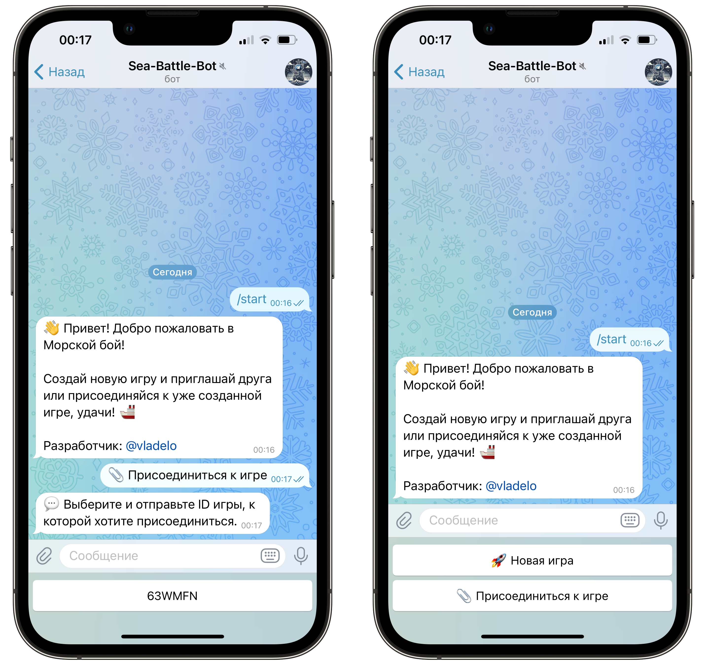
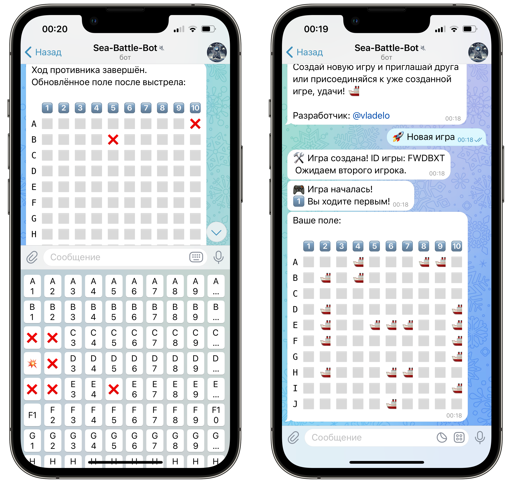

# **Sea-Battle-Bot** 🌊

**Sea-Battle-Bot** — это увлекательный Telegram-бот для игры в классический **морской бой** между двумя игроками! 💥  
Погрузитесь в атмосферу морского сражения и испытайте свои тактические навыки на поле боя! ⚔️

---

## 🎮 **Основные возможности**

- 🆕 **Создавайте новую игру** или подключайтесь к уже существующей.
- 👥 **Дуэль между двумя игроками** — сражайтесь с друзьями в режиме реального времени!
- 🔥 **Полноценная механика боя** с интуитивным вводом координат.
- 🎯 **Интерактивные кнопки** для выстрелов по полю.
- 📡 **Уведомления о ходе игры** и результатах выстрелов.
- 🗺️ **Отображение полей:**
  - Поле противника с отметками только выстрелов (без видимых кораблей).  
  - Собственное поле с отображением всех кораблей и следов попаданий.
- 📝 **Сообщения о ходе игры** с именами игроков и результатами каждого выстрела.
- 🏳️ **Возможность сдаться** прямо во время игры.

---

## 🚀 **Как начать игру**

1. 🔗 Добавьте бота в Telegram и запустите его.
   ```
   @vladelo_sea_battle_bot
   ```
2. 📝 Создайте новую игру по кнопке:
   ```
   🚀 Новая игра
   ```
3. ⏱️ Дождитесь подключения второго игрока.
4. 🛜 Или подключитесь сами по кнопке:
   ```
   📎 Присоединиться к игре
   ```
5. 🗳️ Выберите доступные игры в меню.
6. 🪖 Получите сообщение о начале игры с именем игрока, который ходит первым.
7. 🎯 Стреляйте, выбирая координаты на интерактивной клавиатуре! Например:
   ```
   А1
   ```
8. 💥 Наслаждайтесь яркими эффектами попаданий и промахов!  
9. 🏆 Победите, уничтожив все корабли противника!





---

### 🎯 Технологии

Бот реализован с использованием следующих технологий и библиотек:

- **[Aiogram](https://docs.aiogram.dev/)** — асинхронный фреймворк для создания Telegram-ботов на Python. Позволяет легко работать с Telegram API и поддерживает работу с инлайн-кнопками, командами и обработчиками сообщений.  
- **[Asyncio](https://docs.python.org/3/library/asyncio.html)** — встроенная библиотека Python для асинхронного программирования. Используется для выполнения асинхронных задач и обеспечения высокой производительности бота.  
- **[Python-dotenv](https://pypi.org/project/python-dotenv/)** — библиотека для загрузки переменных окружения из файла `.env`. Упрощает хранение токена бота и других настроек.  
- **[Random](https://docs.python.org/3/library/random.html)** — стандартная библиотека Python для генерации случайных чисел. Используется для случайного выбора первого игрока и генерации игрового поля.  
- **[OS](https://docs.python.org/3/library/os.html)** — стандартная библиотека Python для работы с операционной системой. Используется для получения переменных окружения и управления файловой системой.  

---

## 📂 **Структура проекта**  
```
/Sea-Battle-Bot
│── bot.py             # Код Telegram-бота
│── config.py          # Загрузка настроек (токен для бота)
|–– game_logic.py      # Логика игры: создание и измнение поля, установка кораблей и тд.
|–– handlers.py        # Организация обработчиков команд и сообщений бота
|–– storage.py         # Хранение данных текущих сессий
|–– keyboards.py       # Клавиатуры для бота
│── utils.py           # Вспомогательные функции: генерация ID игры
│── .env               # Файл с токеном бота (скрыт от Git)
│── requirements.txt   # Зависимости (aiogram, dotenv и т.д.)
│── .gitignore         # Исключаем .env, __pycache__, venv и др.
```

---

## 🛠️ **Технические детали**

- 🐍 Язык программирования: **Python**
- 🤖 Фреймворк: **Aiogram**
- 💡 Логика игры: поля представлены в виде двумерного списка с символами:
  - ⬜ — пустая клетка
  - 🚢 — часть корабля
  - ❌ — промах
  - 💥 — попадание

---

## 📝 **Установка и запуск**

1. 🗃️ Клонируйте репозиторий:
   ```bash
   git clone https://github.com/vladelo777/sea-battle-bot.git
   ```
2. 📂 Перейдите в папку проекта:
   ```bash
   cd sea-battle-bot
   ```
3. 📦 Установите зависимости:
   ```bash
   pip install -r requirements.txt
   ```
4. ⚙️ Настройте переменные окружения:
   ```bash
   export TELEGRAM_TOKEN=<ваш_токен>
   ```
5. 🚀 Запустите бота:
   ```bash
   python bot.py
   ```
   
---

## 💡 **Пример использования**

1. Создайте новую игру:
   ```
   🚀 Новая игра
   ```
2. Подключитесь к игре, выбрав ID в появившемся списке, после команды:
   ```
   📎 Присоединиться к игре
   ```
3. Дождитесь начала боя и ходите первым, если повезёт! 🍀
4. Используйте клавиатуру для выстрелов и следите за результатами:
   - 💥 — попадание!
   - ❌ — промах.
   - 🚢 — корабль на вашем поле.
   - ⬜ — пустая клетка.
5. Наслаждайтесь эпичными морскими баталиями! 🌊

---

## 🛠 **Дополнительно**  
- Чтобы скрыть `BOT_TOKEN`, **не загружай `.env` в Git** (он уже в `.gitignore`).  
- Бот поддерживает ReplyKeyboardMarkup и KeyboardButton для функционирования кнопок управления.

---

## 📬 **Контакты**

Автор: Владислав Лахтионов  
GitHub: [vladelo777](https://github.com/vladelo777)  
Telegram: [@vladelo](https://t.me/vladelo)  

💌 Не забудьте поставить звезду ⭐ на GitHub, если вам понравился бот! 😉
